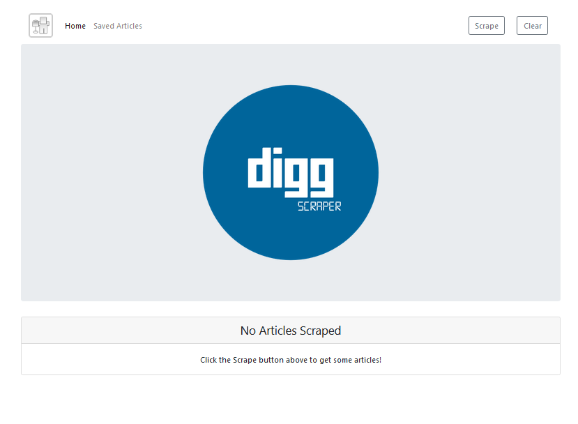
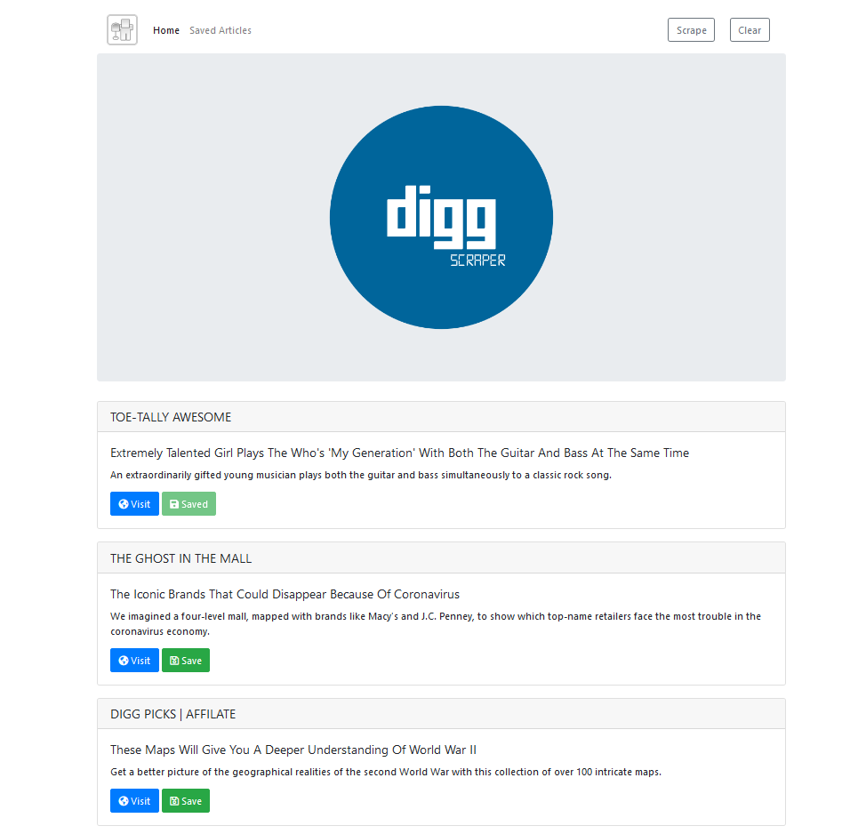
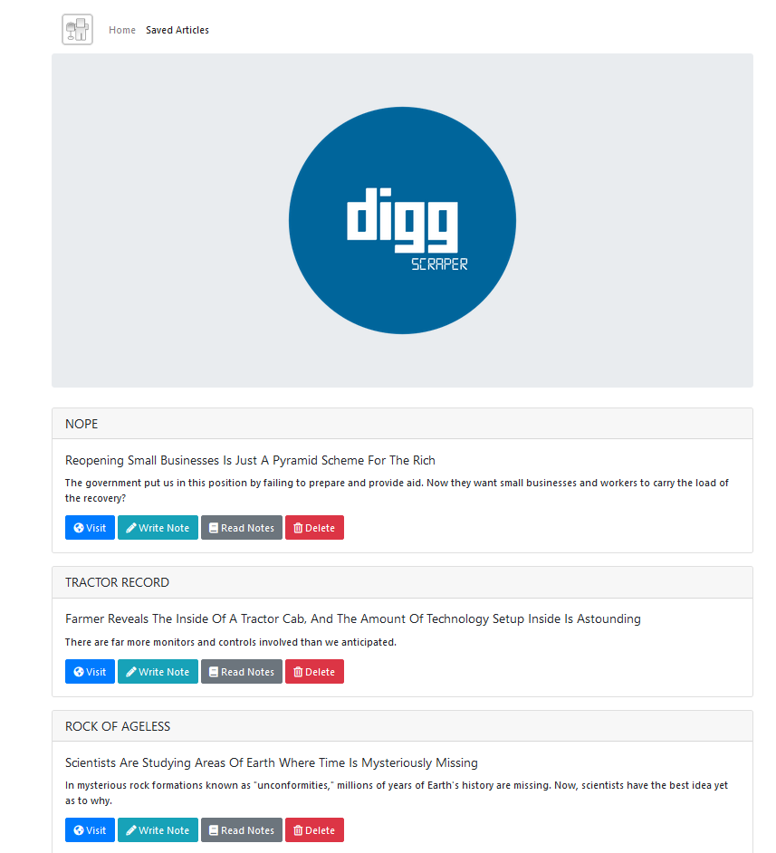
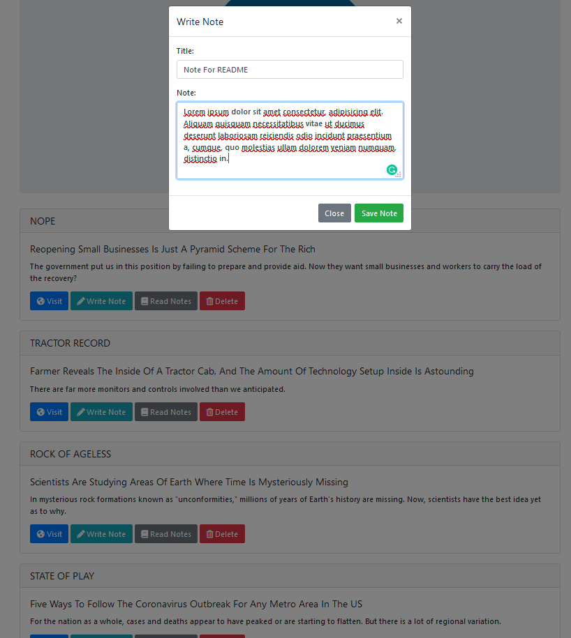
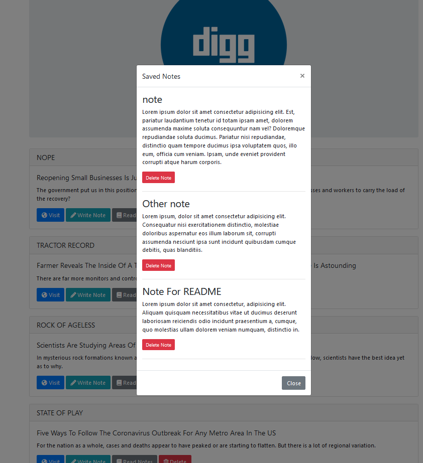

# Digg-Scraper

## Overview
Digg Scraper is a Node.js based application that pulls article info from http://www.digg.com and displays it in a simple card format. It also allows users to save articles and comments on them to a Mongo database.

## Deployment
You can view Digg Scraper by [Clicking Here](https://digg-scraper.herokuapp.com/)

## User Experience

The view of the page is related to its database. So visiting the application can display either two things.

- Previous articles scraped from another user

- A cleared page with no articles shown

Either way, if articles are scraped, users have the option to save them to a separate database for viewing at a later time. Once saved the user has the option to delete them as well.

Users also have the option to create notes (header and body) for each saved article. Once created, these notes are saved to a separate database for viewing in their own modal popup. Also in this modal popup is the option to delete individual notes.

## Application Walkthrough
### Inital loaded page (if no articles were left by another user).

### After scraping, the articles currently on Digg load in a card format. Users can save articles they wish to look at later.

### Saved articles page. Users can add notes for each individual article.

### Clicking 'Write Note' loads this module where a note title and body can be written and saved.

### Users can read all notes stored for each individual article and delete notes stores as well.

## Technology Used
- JavaScript
- Node.js
- Axios
- Cheerio
- Express
- Handlebars
- Mongoose
- HTML
- CSS
- Bootstrap
- jQuery
- MongoDB

